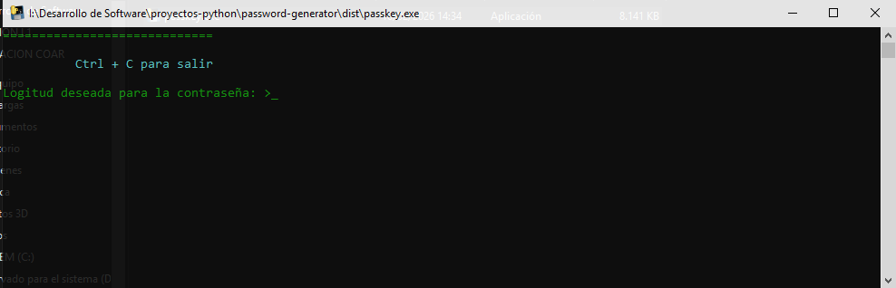

# PassKey: Advanced Password Generator

**PassKey** es un generador de contraseñas robusto desarrollado en **Python**, diseñado para crear claves criptográficamente seguras y aleatorias.

> [!WARNING]
> **Importante:** Una vez generada la contraseña, asegúrate de copiarla y guardarla en un lugar seguro (como un gestor de contraseñas). PassKey no almacena tus claves por motivos de seguridad.

## Características de las contraseñas

Para garantizar la máxima protección, cada clave generada incluye una mezcla de:

- **Letras:** Mayúsculas y minúsculas ($A-Z, a-z$).
- **Símbolos:** Caracteres especiales para evitar ataques de fuerza bruta.
- **Números:** Dígitos del $0$ al $9$.

---

## Instalación y Uso

Sigue estos pasos para empezar a proteger tus cuentas:

### 1. Descarga

Dirígete a la sección de [Releases](https://github.com/angelobenites/password-generator/releases) y descarga el ejecutable más reciente: `passkey.exe`.

- **Requisito:** Windows 10 o versiones superiores.

### 2. Ejecución rápida

1. Haz clic derecho sobre el archivo `passkey.exe`.
2. Selecciona **"Ejecutar como administrador"**.
3. Se abrirá una terminal: ingresa la longitud deseada (recomendamos **30** caracteres para máxima seguridad).

---

## Configuración Avanzada (Acceso Global)

Si prefieres ejecutar **PassKey** desde cualquier terminal (CMD o PowerShell) simplemente escribiendo su nombre, sigue estos pasos:

1. **Preparación:** Crea una carpeta en tu disco `C:\`, por ejemplo: `C:\angelo.tools\`.
2. **Mover:** Coloca tu archivo `passkey.exe` dentro de esa carpeta.
3. **Variables de Entorno:**
   - En el buscador de Windows, escribe: _"Editar las variables de entorno del sistema"_.
   - Haz clic en el botón **Variables de entorno**.
   - En la sección "Variables del sistema", busca la variable **Path** y haz clic en **Editar**.
   - Haz clic en **Nuevo** y pega la ruta de la carpeta: `C:\angelo.tools\`.
   - _Nota: Asegúrate de añadir la ruta de la carpeta, no la del archivo .exe._

¡Listo! Ahora puedes abrir una terminal en cualquier lugar, escribir `passkey` y la app se iniciará automáticamente.

---

> [!IMPORTANT]
> El nombre del archivo y las funcionalidades pueden recibir cambios en futuras actualizaciones. Mantente atento a los nuevos lanzamientos.

---

> [!TIP]
> **Powered By [Angelo Benites](https://github.com/angelobenites)**
